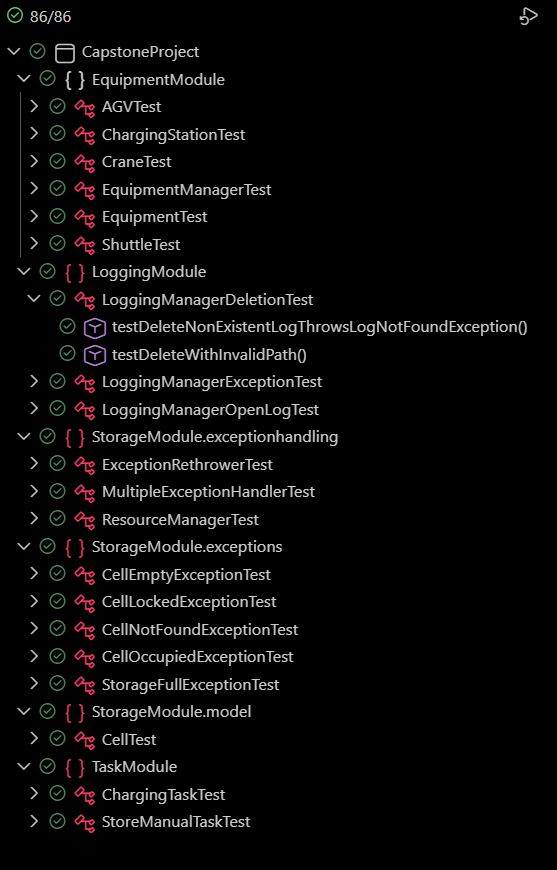

# Warehouse Management System (Team 11)

[](https://www.oracle.com/java/)
[](https://github.com)

> A Thread-safe warehouse management system with automated AGV coordination, real-time storage management, and intelligent charging orchestration.

Access our Screencast: [Screencast of Capstone Project](https://drive.google.com/file/d/1jrlGvk98sc07GsNpCNYLMugci5zKijiy/view?usp=drive_link)

---

##  Features

###  **Core Capabilities**
-  **Thread-Safe Operations** - Handles concurrent AGV operations without race conditions
-  **3D Warehouse Grid** - Full 3D storage with rows × columns × levels
- **Automated AGVs** - Self-coordinating autonomous guided vehicles
-  **Smart Charging** - Intelligent battery management and charging queue
- **Real-Time Logging** - Comprehensive activity tracking
- **Exception Handling** - Robust error management

---

## 📦 Project Structure
```
CAPSTONEPROJECT/
│
├──  StorageModule/          # Warehouse storage management
│   ├── model/
│   │   ├── Cell.java          # Individual storage cell
│   │   ├── Item.java          # Stored items
│   │   ├── Position.java      # 3D coordinates
│   │   └── Storage.java       # Warehouse grid
│   ├── service/
│   │   └── StorageManager.java # Thread-safe operations
│   └── exceptions/
│
├──  EquipmentModule/        # AGV and equipment management
│   ├── model/
│   │   ├── AGV.java           # Autonomous Guided Vehicle
│   │   ├── Equipment.java     # Base equipment class
│   │   ├── ChargingStation.java
│   │   ├── Crane.java
│   │   └── Shuttle.java
│   └── service/
│       └── EquipmentManager.java # Thread-safe equipment control
│
├──  TaskModule/               # Task orchestration
│   ├── ChargingTask.java       # Battery charging operations
│   ├── StoreManualTask.java    # Storage operations
│   ├── StoreAutoTask.java      # Storage operations
    ├── MoveItemTask.java       # Storage operations
│   └── RetrieveItemTask.java   # Storage operations
│
└──  LoggingModule/          # Activity logging
    └── LoggingManager.java
```

---
##  Quick Start

### **Prerequisites**
- **Java 21 or higher**
- **Eclipse IDE** (or any Java IDE)  
- **JUnit 6.0.1 standalone JAR** for running tests  
  - Download from: [JUnit 6.0.1](https://junit.org/junit6/)  
  - Add to your project's build path or classpath for testing  
- **JavaFX** (correct version for your Java)  
  - Needed for GUI / visualization components (if used)  
  - Add JavaFX library to the project build path
---
### Running in Eclipse
1. Import the project:
   - `File -> Import -> Existing Java Project`
2. Set JDK 21 in:
   - `Project Properties -> Java Build Path -> Libraries`
3. Add **JUnit 6.0.1 standalone JAR** to the build path:
   - `Right-click project -> Build Path -> Add External JARs -> junit-6.0.1.jar`
4. Add **JavaFX SDK** libraries:
   - `Right-click project -> Build Path -> Add Library -> JavaFX SDK`
5. Run the main application:
   - Right-click `WarehouseUIComplete.java` (under `src/main/java`) -> `Run As -> Java Application`

##  Test Results

Here are screenshot of test results!



## Team
**Contributors:**
- Ali Farzizada MDT - 7223836
- Usman Rangrez  MDT - 7224089
- Ali Shaaban MDT - 7224591
- Priyanka Gupta MDT - 7224279

---
