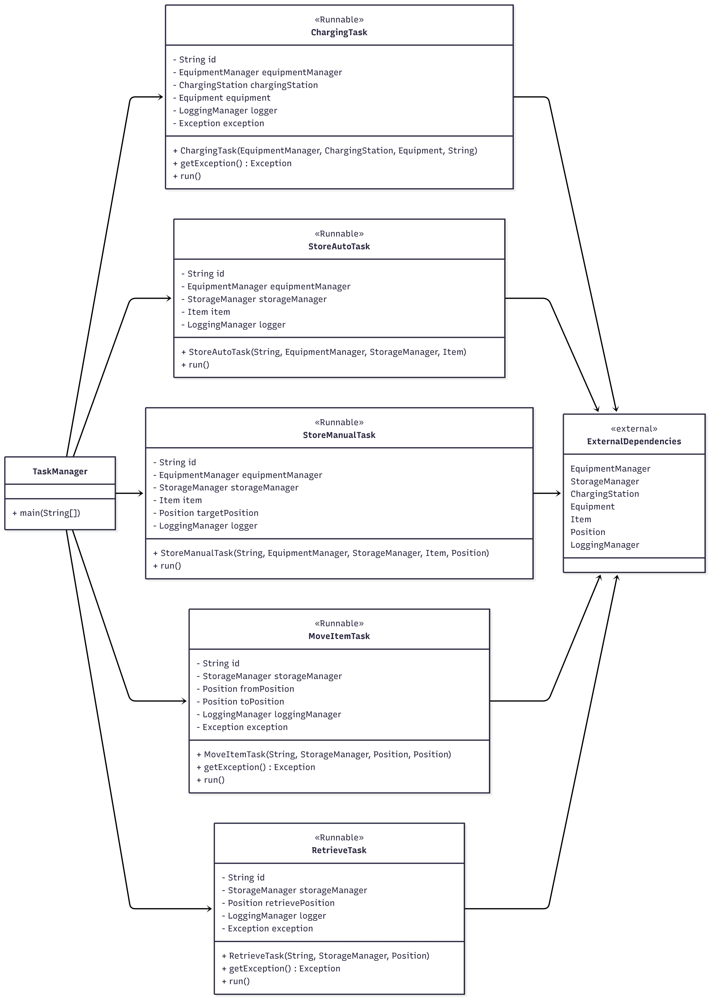
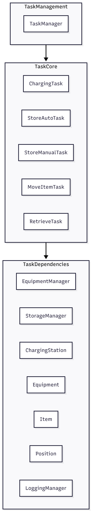

# 📦 Task Module

## 📘 Overview
The **Task Module** is responsible for executing workflow-related operations in our automated storage system project.  
It provides **thread-safe, runnable task classes** that coordinate the **Equipment**, **Storage**, and **Logging** modules to perform operations such as storing, retrieving, charging, and moving items.

This module is part of the CompactJava course project and demonstrates:
- Multi-threaded programming  
- Modular system design  
- Synchronization and data safety  
- Cross-module communication  

---

## 🧩 Responsibilities
The Task Module:
- Encapsulates all task operations as `Runnable` classes  
- Ensures thread-safe handling of shared resources (especially `Item` objects)  
- Updates item state (`MOVING`, `STORED`, `RETRIEVED`, etc.)  
- Performs storage and equipment operations via external module APIs  
- Logs all events using the Logging Module  
- Handles exceptions and provides them via `getException()`  

---

## 📂 Folder Structure
```
src/
├─ main/
│   └─ java/
│       └─ TaskModule/
│           ├─ StoreManualTask.java
│           ├─ StoreAutoTask.java
│           ├─ RetrieveItemTask.java
│           ├─ MoveItemTask.java
│           ├─ ChargeTask.java
│           └─ (other supporting classes)
│
└─ test/
    └─ java/
        └─ TaskModule/
            └─ (unit tests)

```

---

## 🧩 Architecture & Dependencies

### External Modules Used
| Module | Purpose |
|--------|---------|
| **EquipmentModule** | Controls equipment and validates movement operations |
| **StorageModule** | Manages item storage, retrieval, and positioning |
| **LoggingModule** | Handles thread-safe logging with levels (INFO, ERROR) |

### Task Classes
Each task class:
- Implements `Runnable`
- Has a unique `id` for tracking and logging
- Uses dependency-injected managers (`EquipmentManager`, `StorageManager`)
- Logs all operations
- Ensures thread-safety around shared item resources

Example classes:
- `StoreManualTask`
- `StoreAutoTask`
- `RetrieveItemTask`
- `MoveItemTask`
- `ChargeTask`

---

## 🧵 Thread-Safety
Tasks often operate on shared items. To avoid race conditions, tasks synchronize on the `Item` object:

```java
synchronized (item) {
    item.updateStatus(Item.Status.MOVING);
    storageManager.addItem(item, targetPosition);
    item.updateStatus(Item.Status.STORED);
}
```

## Error Handling
- Exceptions during task execution are caught internally.
- The item’s status is reverted to a safe fallback.
- Errors are logged using `LogLevel.ERROR`.
- The thrown exception is stored:
    ```java
    public Exception getException()
    ```
This allows external code (GUI, tests) to verify task success.

## Unit Test
Unit tests are located under:
```
src/test/java/TaskModule
```

## UML Class and Component Diagram
 You can diagrams for this Task module.


### UML Class Diagram
 

 ### Component Diagram
 

